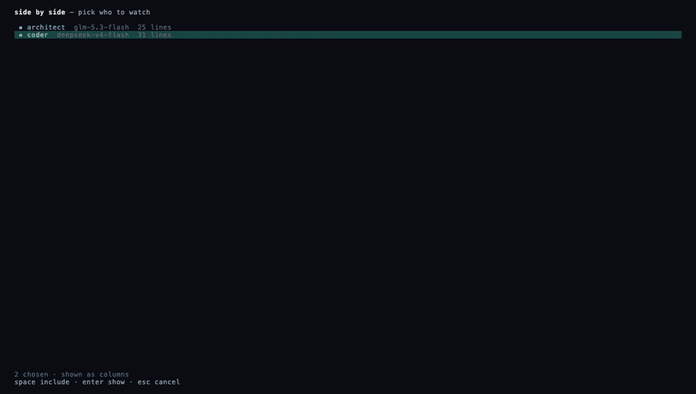

# aidcrew

[](https://github.com/antoniociccia/aidcrew/actions/workflows/ci.yml)
[](https://github.com/antoniociccia/aidcrew/releases/latest)
[](LICENSE)

A team of coding agents, each on its own provider and model, every job in a git
worktree of its own, in one terminal.

```
  architect  claude-opus-5      coder  deepseek-v4-flash ◆   reviewer  free-tier
  ▸ Plan in PLAN.md: rotate…  ⠹ thinking                   ▸ The multiplier is fine…
```


*One take, cut for length. An empty repository, the setup wizard, a key, a team
of two. The architect plans on `glm-5.3-flash`; the coder builds, tests and
commits on `deepseek-v4-flash`; the architect verifies the branch and merges it
— both through OpenRouter, the whole run under a cent. What the shell runs at
the end is `main`.*

Two claims, and the code is the argument for both.

**Everything is a plugin.** The core knows no provider, no tool, no file format.
What ships in `plugins/` — the OpenAI, Anthropic and Gemini dialects, the
filesystem and shell tools, the guards, compaction, prices — loads through the
same registry a stranger's plugin does.
If the contract were not enough to write them, the contract would be wrong.

That is a test rather than a paragraph. `packages/core/src/architecture.test.ts`
fails the build if the core imports a tool or a provider, if it reaches out of
its own package by path, or if it so much as names a real service in a string:

```ts
const forbidden = /\b(openai|anthropic|deepseek|openrouter|gemini|ollama)\b/i
```

`packages/core/package.json` has no `dependencies` key at all.

**Mixed models are the default, not an extension.** Planning on a strong model,
exploring on a free tier, reviewing on a third is how a bill stays affordable,
and it only works if two agents can hold two credentials on two services in one
session. That is the base case here.

## Install

One file, no runtime to install alongside it. From the
[latest release](https://github.com/antoniociccia/aidcrew/releases/latest):

```sh
# macOS, Apple silicon. Swap the name for your platform.
curl -Lo aidcrew https://github.com/antoniociccia/aidcrew/releases/latest/download/aidcrew-macos-arm64
chmod +x aidcrew && sudo mv aidcrew /usr/local/bin/
aidcrew --version
```

Builds are published for macOS (arm64, x64), Linux (x64, arm64) and Windows
(x64), with a `checksums.txt` beside them. Before a release is published, the
binary it built is started on each of the three. On Windows the shell tool
runs `bash`, so have Git for Windows on the PATH — or take the Linux build
under WSL, which is the better-worn road.

From source, which is what you want if you are going to change it:

```sh
git clone git@github.com:antoniociccia/aidcrew.git
cd aidcrew && bun install     # Bun 1.3 or later
bun run build                 # a binary for this machine, in dist/
```

## Try it

```sh
aidcrew demo
```

Sixty seconds, no key and no account: a throwaway project with a real bug, and
a model that does not exist. Real files, the real tools, the real loop —
nothing leaves your machine. It ends with the check passing, or it tells you
that is a bug in aidcrew.

With a key of your own:

```sh
aidcrew config set-key provider:zen   # read from stdin, never an argument
aidcrew -p "make the failing test pass"
aidcrew                               # the interface: the whole team, one screen
```

## The team

Agents come from the files a project already has — `.claude/agents/*.md` by
default — read where they are rather than imported, so a definition edited for
another tool is current here too. Which of them are on *this* team, and what
each one runs on, is `.aidcrew/config.toml`:

```toml
[agents.architect]
provider = "anthropic"
model = "claude-opus-5"
tools = ["read", "bash"]          # designs, does not write

[agents.coder]
provider = "zen"
model = "deepseek-v4"

[agents.reviewer]
provider = "zen"
model = "deepseek-v4-flash-free"  # review at no cost
tools = ["read", "bash"]
```

Committed with the repository, so whoever clones it gets the team.

An agent file says what one agent is *for*. How the team works together — hand
the work on rather than stopping to ask, what a handoff has to carry, what
counts as finished — is one thing said once, in `ORCHESTRATE.md`:

```markdown
# Notes for whoever edits this
Everything above the rule is for you. The agents never see it.

---

Nobody is watching this run. When the next step is clear, take it. When it
belongs to somebody else, send it with `agent_send` and say what you expect
back. Finished means checked, not written.
```

It reaches every agent on every request, after its own file and after the
roster — which aidcrew supplies, because who is running changes while the
session does and no file on disk can know it. You need not write one: without
it a team works on the same wording built in. Call it something else, or keep
one for every project, with `[sources] orchestration` beside `agents` and
`skills`.

One agent leads, and every job comes back to it. When the architect hands a fix
to the coder and the coder hands it to the tester, the tester's verdict returns
to the architect — not to the coder it heard from — so the one who was given
the job is the one who decides it is done. Name the leader with `[defaults]
leader`; it defaults to the first agent the project declares, and it is the one
agent that cannot be dropped from the team, because a team whose leader was
removed has nowhere for work to come back to.

Every job gets a `git worktree` of its own, shared by the agents working it.
`/task rotate-keys coder reviewer` opens one; the checkout you are sitting in is
never touched, and two jobs running at once are two separate diffs rather than
one corrupted file. `aidcrew undo` takes back the last change any of them made.

A checkout with work in it outlives the session. Close the terminal with files
changed and not committed, or with commits on no branch, and the worktree
stays under `.aidcrew/wt/`; the next session picks it up where it was left and
says so. Only a clean checkout, or one whose work a branch already holds, is
taken away.

### Roles

An agent can carry a `role`, which several agents may share. Work addressed to a
role goes to whichever agent on it is free:

```toml
[agents.coder]        # role defaults to the agent's own name
[agents.coder-night]
role = "coder"
```

Naming a file with `@` sends it: `what does @src/auth.ts do?` arrives with the
file attached, rather than costing the agent a turn to go and find it. `^t`
finds one by part of its name, for the keyboards where `@` is awkward.

`^l` puts two agents side by side, so a handoff can be watched from both ends.
The divider between them moves with the mouse or with `^←` and `^→`:



Typing `/spawn coder` starts another one mid-session, onto the job you are on
and into the same checkout, without leaving what you were doing. `/help` lists
the rest, and `/tour` is eight pages on what the whole thing is — the same
ones a first run ends on.

When they are all busy there is a decision to make, and it is not the sender's.
The question appears in the pane of the agent it is about, with the three
answers that exist: wait, start a second agent of that role, or drop it and tell
the sender so. A headless run queues, as it always did.

A turn is bounded — fifty tool calls, so a model going round in circles is
stopped — and an agent you have turned loose with `/yolo` is sent back to carry
on when it reaches that bound with the work unfinished, a few times, before the
stop is real. Nobody watching means nobody to say "go on", so the harness says
it. An agent that is asking first stops and waits for you.

## Writing a plugin

Drop a TypeScript module in `~/.aidcrew/plugins` or `.aidcrew/plugins`. No
build step, no publishing, no restart. A plugin declares any of six things —
`providers`, `tools`, `loaders`, `hooks`, `prices`, `ui` — and a whole provider
is about twenty lines:

```ts
import { definePlugin, defineProvider } from '@aidcrew/plugin-sdk'
import { z } from 'zod'

export default definePlugin({
  name: 'my-service',
  providers: [
    defineProvider({
      id: 'my-service',
      endpoint: 'https://api.example.com/v1',
      configSchema: z.object({ apiKey: z.string().min(1) }),
      create: ({ apiKey }) => ({
        id: 'my-service',
        async *send(request, signal) {
          // Translate the canonical request, stream back canonical deltas.
        },
      }),
    }),
  ],
})
```

`request` is the canonical model — `Message`, `ContentBlock`, `Usage`,
`StopReason` — which no provider sees from outside. Adding a service never
changes those types, and never changes the core.

A provider that lacks tool calling, or has it and gets it wrong, declares so;
the harness then puts the tools in the prompt and reads the calls back out of
the text. That is the normal case on several open models, and it is the reason
this seam exists rather than a list of blessed services.

A plugin that needs to know something first exports `setup(host)`, called once
before it registers; what it returns is merged over what it declared. The host
it is handed is small on purpose — where the work is, where your files are, its
own settings from `[plugins.<name>]` in the project config, a way to ask you a
yes-or-no question, a way to say something, a directory of its own — and every
item is something a plugin cannot work out for itself. That is what lets a
stranger ship a plugin for their issue tracker: it can ask for the name of the
variable holding a token instead of telling people to paste one into the
source. [`examples/plugin-with-setup`](examples/plugin-with-setup/index.ts) uses
all of it and imports nothing private.

```sh
aidcrew plugin check ./my-plugin   # what the host will say about it, before you ship
aidcrew plugin trust my-plugin     # a plugin that arrived with a clone runs only once you say so
```

## What is here

| | |
|---|---|
| **Providers** | Anthropic; Gemini; anything OpenAI-compatible (Zen, OpenRouter, DeepSeek, GLM, Ollama, vLLM), in both dialects, choosing between them by trying |
| **Tools** | `read`, `write`, `edit`, `grep`, `glob`, `wc`, `awk`, `lsof`, `bash`, `skill`, and `agent_send` between agents. Everything that only reads is a tool of its own rather than a shell command, so looking something up does not need approving |
| **MCP** | Any MCP server, over stdio or HTTP, declared in the `.mcp.json` a project already has. Its tools arrive as ordinary tools and the agent loop never learns the difference. A server is a program, so one a project declares does not start until `aidcrew mcp trust <server>` says it may |
| **Guards** | A never-write list, an always-ask list, and a snapshot of every file before it changes. On every path, because they are registered with the host rather than by each caller — and headless has nobody to ask, so what would have been a question there is a refusal |
| **Context** | Conversations shortened when they no longer fit, summarised by a cheaper model when the project names one |
| **Cost** | Per agent and per session, from the provider's own price list, from the project's stated prices, or from the remaining balance on the key |
| **Images** | Pasted into the prompt and sent to models that accept them |
| **Sessions** | Every turn written to disk; a session resumes where it was left, transcript, history and checkouts included |
| **The screen** | The alternate screen buffer, so nothing scrolls and the shell comes back as it was; every frame exactly the window's height, so it never blinks; drag over a pane to copy what it says |

## Layout

```
packages/core          canonical types, agent loop, plugin registry, agent bus,
                       governor, worktrees, event log — no provider, no tool
packages/plugin-sdk    definePlugin() and the types for writing one
packages/cli           commands, credentials, history
packages/tui           the interface
packages/fast-width    terminal width measurement, because the usual one
                       dominated every frame
plugins/               the official plugins, loaded like any other
```

## Development

```sh
bun test
bun run typecheck
bun run lint
bun run build:all # every platform, cross-compiled from any one of them
```

What changed between releases is in [CHANGELOG.md](CHANGELOG.md).

Releases are cut from a tag:

```sh
bun run version:set minor     # writes the version, commits it, tags it
git push --follow-tags        # CI starts a binary on each platform, then publishes all five
```

Test first, then the smallest code that passes, then tidy up. A bug gets a test
that reproduces it before it gets a fix.

## Contributing

This is a young project and it is better with more hands on it. The places
where help matters most right now:

- **Providers and plugins.** A service you use that is not on the list above
  is a twenty-line plugin away; [`examples/`](examples/) shows the shape.
- **Windows.** The binary is built and started there on every release; the
  tools have been run there far less. Reports from real use are worth more
  than anything else.
- **Models and prices.** The bundled price list and the ranking that puts
  models in front of a newcomer are both in [`plugins/prices`](plugins/prices)
  and [`packages/tui/src/models.ts`](packages/tui/src/models.ts), and both
  go stale; a correction with a link is a welcome pull request.
- **Agent files and briefings.** Teams that work well for a language or a
  kind of project, as `.aidcrew/agents` files and an `ORCHESTRATE.md`.
- **Themes.** A palette is a few lines in
  [`packages/tui/src/theme.ts`](packages/tui/src/theme.ts).

[CONTRIBUTING.md](CONTRIBUTING.md) has the ground rules — the failing test
first, comments that say why, three checks before a pull request. Questions
and ideas go to [Discussions](https://github.com/antoniociccia/aidcrew/discussions);
something broken goes to an [issue](https://github.com/antoniociccia/aidcrew/issues/new/choose).

## Licence

MIT.
